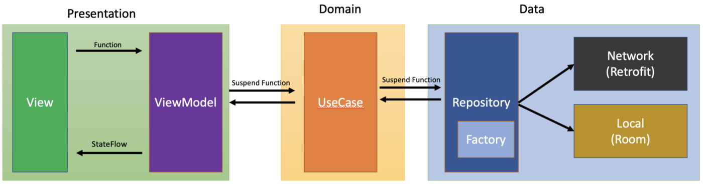

# ✒ My Notes ️

Android application for creating, editing, and deleting personal notes, using Kotlin with Model-View-ViewModel as architecture design.

The application was created as an example of how to implement from the scratch an Android project following the best industry standards, but because of the small scope of the application, some decisions can be faced as overengineering. The idea is to provide a base, even if it’s not necessary for the specific use case.

## 📑 Features

- See all notes created in a list, with a timestamp, title, and first line of content.
- Each note when clicked opens the editor to change the title, content, or color.
- Each note in the list has an edit and delete button.
- Edit button opens the note in the same way when the note is clicked.
- Delete button erases the note from the local database and refreshes the list.
- Behind the title, there’s an option to filter the order of the notes by title, timestamp, or color.
- Add button redirects the user to the editor, where a new note can be created.
- When creating a new note user can set the title, content, and color.
- If the user selects a new color in the editor, the background color of the note is changed.
- The save button inserts the new note into the database and redirects back to the list.
- When a note is deleted, a button to undo and re-create the note appears.

## 🛠 Architecture

  
   
  

